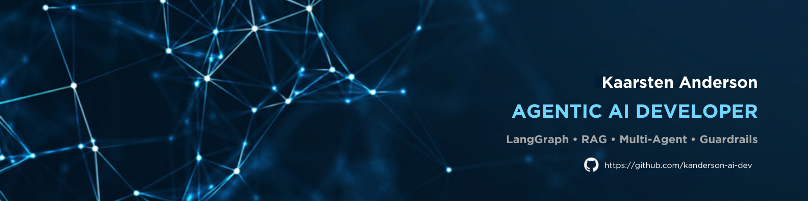

  

### I build production-grade AI agents — guardrailed, evaluated, observable, and shipped with the CI/CD discipline a real business needs before an agent touches production traffic.

---

## 👋 About

8+ years as a full-stack developer (2019–present), the last three focused on LLM
applications and, since 2024, on multi-agent systems built with **LangGraph**.

I don't ship tool-calling demos — I ship the layer above the demo: input/output
guardrails against prompt injection (OWASP LLM Top 10), evaluation scorecards
gated in CI, cost-governed autonomy, human-in-the-loop escalation that survives
a restart, and the observability to prove all of it in production, not just in
a README claim.

- 🤖 **Agentic AI** — LangGraph multi-agent orchestration, Self-RAG, autonomous research agents, guardrailed agent APIs
- 🕷️ **Data extraction at scale** — production-shaped scraping pipelines, browser automation, scheduled monitoring services
- 🧪 **Evaluation-driven** — every system ships with a versioned quality scorecard (faithfulness, cost, latency) gated in CI, not vibes

📄 **[Check out all of my projects →](PROJECTS.md)**

---

## 🛠️ Stack

**Agentic AI / LLM**

**Backend / API**

**Frontend**

**Scraping / Automation**

**Infra / Quality**

---

## 🚀 Featured Projects

### Agentic AI Systems

| Project | What it does | Stack |
|---|---|---|
| **[LangGraph Multi-Agent Orchestrator](https://github.com/kanderson-ai-dev/langgraph-multiagent-orchestrator)** | Multi-tenant Supervisor–Workers platform: dynamic agent teams, runtime `Send()` fan-out, cost-governed autonomy, hash-chained audit trail | LangGraph · FastAPI · Postgres |
| **[Autonomous Web Research Agent](https://github.com/kanderson-ai-dev/agentic-web-researcher)** | Planner dispatches parallel search/scrape workers, a critic re-plans, a writer synthesizes a cited report | LangGraph · FastAPI |
| **[Research Agent — Agents SDK port](https://github.com/kanderson-ai-dev/research-agent-sdk-port)** | The same research agent on a second framework — identical use case/API/scorecard, so LangGraph vs Agents SDK is compared with measured numbers | OpenAI Agents SDK · FastAPI |
| **[Agentic RAG & Knowledge System](https://github.com/kanderson-ai-dev/agentic-rag-system)** | Self-RAG loop: hybrid vector+graph retrieval, self-grading, human escalation instead of hallucinating | LangGraph · Pinecone · Neo4j |
| **[Guardrailed Agentic AI API](https://github.com/kanderson-ai-dev/agentic-api)** | Guardrailed single-agent service: OWASP LLM01/LLM02 defenses, multi-turn memory, SSE streaming | LangGraph · FastAPI |
| **[MCP Agent Toolkit](https://github.com/kanderson-ai-dev/mcp-agent-toolkit)** | MCP server + agent client over stdio: runtime tool discovery, sandbox/SELECT-only/LLM01 guardrails, request-ID-correlated observability | TypeScript · MCP SDK · OpenAI |

### Web Scraping & Data Automation

| Project | What it does | Stack |
|---|---|---|
| **[Enterprise Data Pipeline API](https://github.com/kanderson-ai-dev/enterprise-data-pipeline-api)** | Scheduled, self-healing scraping pipeline with Postgres history and an authenticated REST API | FastAPI · Postgres · Docker |
| **[Dynamic Scraper & AI Change Monitor](https://github.com/kanderson-ai-dev/dynamic-scraper-ai-monitor)** | Browser-driven monitor for JS-heavy sites — change detection with optional LLM extraction, multi-channel alerts | Playwright · SQLAlchemy |
| **[Web Scraper & Directory Extractor](https://github.com/kanderson-ai-dev/python-web-scraper-template)** | Schema-validated catalog/directory extractor — clean CSV/XLSX in a 1-2 hour engagement | BeautifulSoup · Pandas |

📄 **[See the full breakdown — architecture, evaluation metrics, and links for every project →](PROJECTS.md)**

---

📩 **kaarsten.anderson@gmail.com** · 💼 Open to Agentic AI / LLM engineering engagements

